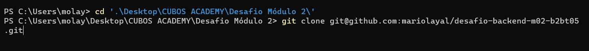
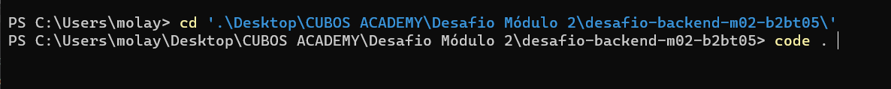

# DESAFIO BACKEND M02


Esse projeto é referente ao desafio técnico do curso de Desenvolvimento de Software com foco em backend, oferecido pela Cubos academy e tem como objetivo o desenvolvimento de um API para um Banco Digital.

As etapas de implementação do projeto estão listadas abaixo:

## REPOSITÓRIO

1. Acessar o repositório no github da cubos academy disponível no link: <https://github.com/cubos-academy/desafio-backend-m02-b2bt05/tree/main>

2. Fazer um fork do repositório no seu repositório pessoal:


3. Copiar o link SSH no seu repositório criado:


4. No terminal do seu computador, realizar o **git** **clone** do repositório dentro da pasta onde irá salvar o arquivo:


5. Agora é so abrir o arquivo no VS CODE. 
PS: para abrir pelo terminal é só utilizar a função **code** **.** dessa forma:


6. Agora vamos começar a configurar o servidor

## CONFIGURAÇÃO DO SERVIDOR:

1. No terminal do VS CODE, inicialize o projeto Node.js através do comando **npm** **init** **y**;

2. Instale o framework que auxilia na criação do servidor. Neste projeto, utilizamos o express. Para instalar é só utilizar o comando **npm** **install** **express**;

3. Instale a ferramenta **nodemon** para facilitar na reiniciação do servidor através do comando **npm** **install** **nodemon**;

4. Crie um arquivo **.gitignore** e dentro dele insira o nome da pasta **node_modules** para evitar que essa pasta do express seja comitada quando você for enviar o arquivo para o github;

5. Agora vamos começar a configurar o projeto.

## PROJETO

### CONFIGURAÇÕES DO PROJETO

1. Primeiro vamos organizar nossos arquivos:
    - Crie uma pasta com o nome **src** que será onde criaremos todos nossos arquivos;
    - Crie o arquivo principal onde abriremos a porta do servidor e ''chamaremos'' as rotas criadas. Neste projeto, esse arquivo foi criado com o nome **index.js**;
    - Crie um arquivo com o nome **roteador.js** onde criaremos as rotas de acordo com os requisitos do desafio;
    - Crie um arquivo com o nome **bancodedados.js** onde ficaram todos os dados necessários para a realização do projeto;
    - Dentro da pasta **src** crie uma nova pasta chamada **controladores** e depois, crie um arquivo chamado **controladores.js** onde ficaram as funções responsáveis por realizar os comandos do projeto;
    - Crie também, dentro da pasta **src** um arquivo chamado **intermediarios.js** caso precise utilizar intermediários no código;

2. Agora faremos as configurações inicias no arquivo **index.js**:
    
    - Importe o express através do comando **const** **express** **=** **require('express')**;
    - Instancie o express através do comando **const** **app** **=** **express()**;
    - Crie a rota em que o servidor sera executado através do comando **app.listen(3000)**;
    - Adicione o midleware através do comando **app.use(express.json( ))**;
    - Importe o arquivo das rotas criadas no arquivo **roteadores.js** através do comando **const rotas = require('./roteadores')**;

3. Agora faremos as configurações iniciais no arquivo **roteadores.js*:

    - Importe o express através do comando **const** **express** **=** **require('express')**;
    - Instancie o express através do comando **const rotas =express()**;
    - Exporte o arquivo para ser usado no arquivo principal (index.js) através do comando **module.exports = rotas**;

4. Agora faremos as configurações iniciais no arquivo **bancodedados.js**:
    - Usaremos os seguintes dados: 
    ```
    module.exports = {
    banco: {
        nome: 'Cubos Bank',
        numero: '123',
        agencia: '0001',
        senha: 'Cubos123Bank'
    },
    contas: [],
    saques: [],
    depositos: [],
    transferencias: []
}

5. Agora vamos começar a implementar o projeto a partir dos requisitos colocados no desafio. Em seguida, vou listar os requisitos para que você mesmo tente criar o API sozinho.

### REQUISITOS DO PROJETO

- [ ] Criar conta bancária;
- [ ] Listar constas bancárias;
- [ ] Atualizar os dados do usuário da conta bancária;
- [ ] Excluir uma conta bancária;
- [ ] Depositar em uma conta bancária;
- [ ] Sacar de uma conta bancária;
- [ ] Transferir valores entre contas bancárias;
- [ ] Consultar saldo da conta bancária;
- [ ] Emitir extrato bancário.

Bom desafio. 

Depois quero saber como foi, e lembre:
